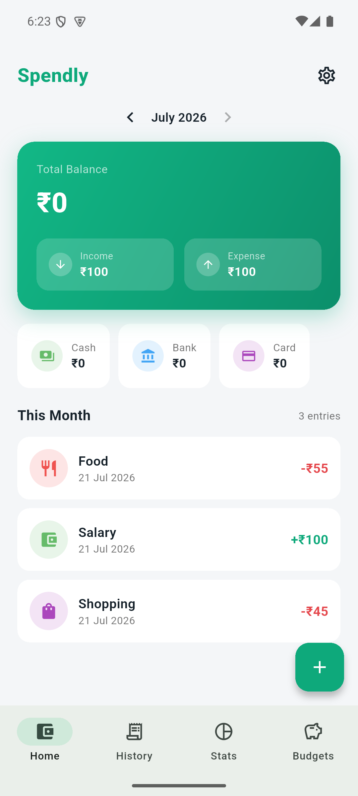
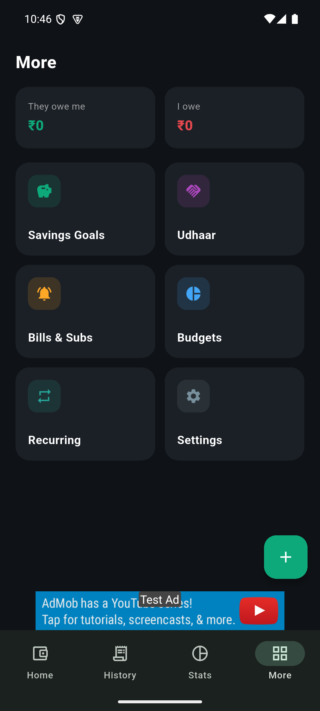
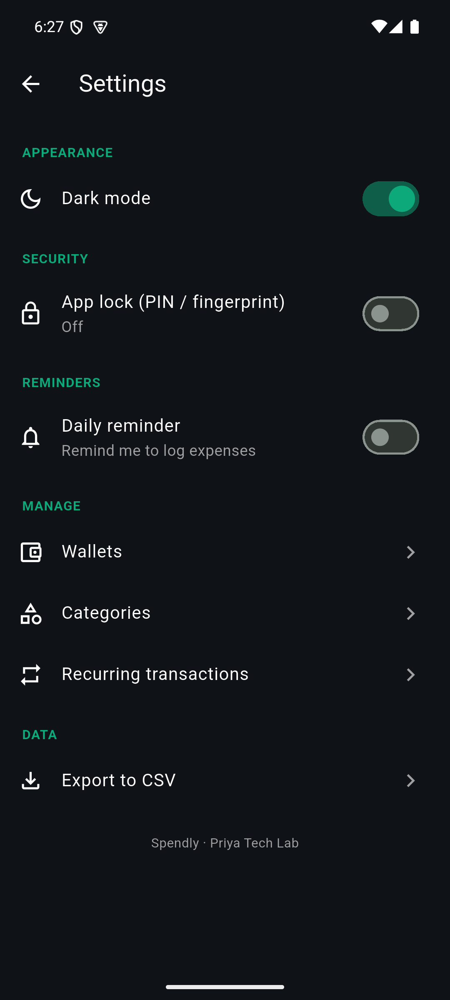

<div align="center">


# Spendly — Expense & Budget Tracker

**A modern, private, fully-offline money manager for Android, built with Flutter.**

Track spending, set budgets and goals, never miss a bill — all on your device, no account needed.


</div>

---

## ✨ Features

- **Track income & expenses** with categories, wallets (Cash / Bank / Card), notes and dates
- **Multiple wallets** — see the balance of each account separately
- **Budgets** — set a monthly limit per category with progress bars and over-budget warnings
- **Savings goals** — set a target, add money, watch a progress bar fill
- **Udhaar (lend / borrow)** — track who owes you and who you owe, with settle-up
- **Bills & subscriptions** — due-day tracking with monthly reminder notifications
- **Statistics** — spending-by-category donut + 6-month trend chart, with month navigation
- **Smart insights** — "you're spending X% more than last month"
- **Logging streak** 🔥 — a daily streak to keep the habit going
- **Custom categories** with your own icon and colour
- **Recurring transactions** — auto-add salary / rent each month
- **Dark mode**, **app lock** (PIN + fingerprint), **daily reminder**, and **CSV export**
- **100% offline** — no login, nothing leaves your device

## 📱 Screenshots

<div align="center">
<table>
  <tr>
    <td align="center"><br/><b>Home</b></td>
    <td align="center"><br/><b>Features hub</b></td>
    <td align="center"><br/><b>Dark mode</b></td>
  </tr>
</table>
</div>

## 🛠 Built with

| Area | Package |
|------|---------|
| Charts | [`fl_chart`](https://pub.dev/packages/fl_chart) |
| Ads | [`google_mobile_ads`](https://pub.dev/packages/google_mobile_ads) (AdMob) |
| Reminders | [`flutter_local_notifications`](https://pub.dev/packages/flutter_local_notifications) |
| App lock | [`local_auth`](https://pub.dev/packages/local_auth) |
| Storage | [`shared_preferences`](https://pub.dev/packages/shared_preferences) |
| Export / share | [`share_plus`](https://pub.dev/packages/share_plus) |
| Formatting | [`intl`](https://pub.dev/packages/intl) |

## 📂 Project structure

```
lib/
├── main.dart            # App shell, theme, nav, banner ad
├── models.dart          # Txn, Wallet, CatDef, Goal, Debt, Bill, Recurring
├── store.dart           # Local state + persistence + computed values
├── theme.dart           # Light/dark themes + adaptive colours
├── notifications.dart   # Daily reminder + bill reminders
├── lock_screen.dart     # PIN + biometric app lock
├── add_sheet.dart       # Add-transaction sheet
├── pickers.dart         # Icon + colour pickers
└── screens/             # home, transactions, stats, budgets, more,
                         # goals, udhaar, bills, settings, manage
```

## 🚀 Getting started

```bash
flutter pub get
flutter run                # debug (uses AdMob test ads)
flutter build appbundle    # release bundle for Play Store
```

> Ads use Google's **test** IDs in debug and real IDs only in release, so development
> never risks the AdMob account. Release signing is configured via `android/key.properties`,
> which (along with the keystore) is intentionally excluded from version control.

## 📄 License

Released under the MIT License.

---

<div align="center">
Made with 💚 by <b>Priya Tech Lab</b>
</div>
